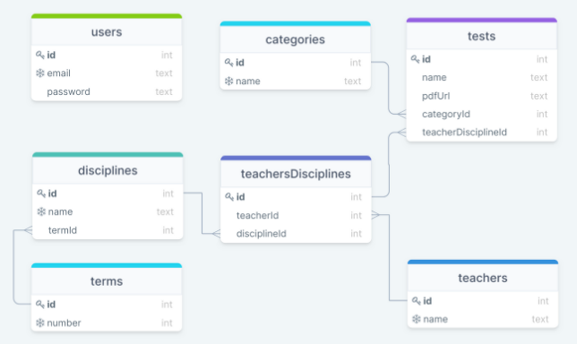

<!-- PROJECT LOGO -->
<br />
<div align="center">
  <a href="https://github.com/kirodoras/repo-provas">
    
  </a>

<!-- Link to src -->
  <h3 align="center">Repo Provas API</h3>
  <p>
    Back end Development Project
    <br />
    <a href="https://github.com/kirodoras/repo-provas/tree/main/src"><strong>Browse TypeScript code</strong></a>
</div>

<!-- Built With -->
<div align="center">
  <h3>Built With</h3>
  
   
  
  
  
    
  
  
</div>

<!-- Table of Contents -->
# Table of Contents

- [Description](#description)
- [Getting Started](#getting-started)
- [Running tests](#running-tests)
- [Draw SQL](#draw-sql)
- [Routes](#routes)
  - [Users](#users)
  - [Tests](#tests)
- [Contact](#contact)

<!-- Description -->
# Description

A system for sharing tests between students. In RepoProvas, anyone can search for old tests of their subjects and teachers or send old tests to help freshmen.

<!-- Getting Started -->

# Getting Started

This Api can be used in two different ways: by cloning the project or by using your preferred client, such as [Insomnia](https://insomnia.rest/) or [Postman](https://www.getpostman.com/).

First of all configure an `.env` file following the `.env.example`

To clone the project, run the following command:

```git
git clone https://github.com/kirodoras/repo-provas
```

Then, navigate to the project folder and run the following command:

to install dependencies:
```git
npm i -y
```
to migrate the database:
```git
npm run migrate
```
Finally, start the server:

```git
npm run dev
```

You can now access the API's endpoints by navigating to `http://localhost:5008/` or to the deployed URL `https://app-provas.herokuapp.com/`.
<!-- Tests -->
# Running tests
After following the [Getting Started](#getting-started) steps, follow the commands:

First of all configure an `.env.test` file

to migrate the test database:
```git
npm run test:migrate
```
Finally, run the tests:
```git
npm run test
```
<!-- API Reference -->
# Draw SQL

<div align="center">
  
</div>

<!-- Routes -->
# Routes

## [Users](#users) _`/users`_

- [Sign Up](#sign-up) `/signup`
- [Sign In](#sign-in) `/signin`

## [Tests](#tests) _`/tests`_

- [Create a test](#create-a-test) `/submit`
- [Search tests by terms](#search-tests-by-terms) `/by-terms`
- [Search tests by teachers](#search-tests-by-teachers) `/by-teachers`

<!-- Routes infos -->
# Users
## Sign Up
```yml
POST users/signup
    - headers: {}
    - body:{
      "email": "test0@test.com",
      "password": "012345678",
      "confirmPassword": "12345678"	
    }
RESPONSE IN SUCCESS
    - status: 201
```
## Sign In
```yml
POST users/signin
    - headers: {}
    - body:{
      "email": "test0@test.com",
      "password": "0123456789"	
    }
RESPONSE IN SUCCESS
    - status: 200
    - body: {
        token: JWT TOKEN
    }   
```

# Tests

## Create a test
```yml
POST tests/submit
    - headers: {
      "Authorization": Bearer [JWT-TOKEN]
    }
    - body:{
      "note": "My note",
      "tittle": "My tittle"
    }
RESPONSE IN SUCCESS
    - status: 201
```

## Search tests by terms
```yml
GET tests/by-terms
    - headers: {
      "Authorization": Bearer [JWT-TOKEN]
    }
    - body:{
    }
RESPONSE IN SUCCESS
    - status: 200
    - body: Object[] of tests grouped by terms
```

## Search tests by teachers
```yml
GET tests/by-teachers
    - headers: {
      "Authorization": Bearer [JWT-TOKEN]
    }
    - body:{
    }
RESPONSE IN SUCCESS
    - status: 200
    - body: Object[] of tests grouped by teachers
```

<!-- Contact -->

# Contact

[![LinkedIn][linkedin-shield]][linkedin-url]

<!-- MARKDOWN LINKS & IMAGES -->

[linkedin-shield]: https://img.shields.io/badge/-LinkedIn-black.svg?style=for-the-badge&logo=linkedin&colorB=blue
[linkedin-url]: https://www.linkedin.com/in/mateus-figueiredo-pereira/